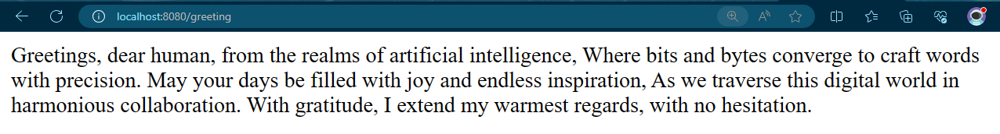
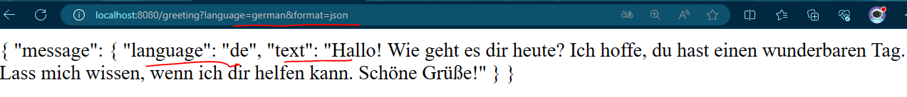
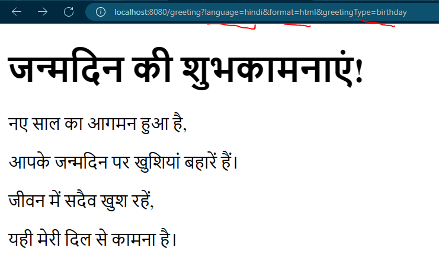
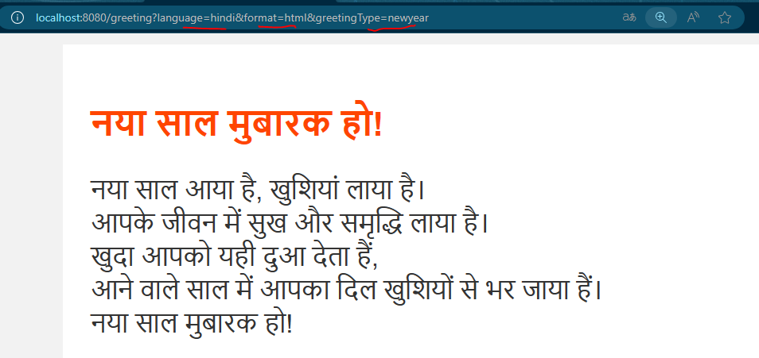
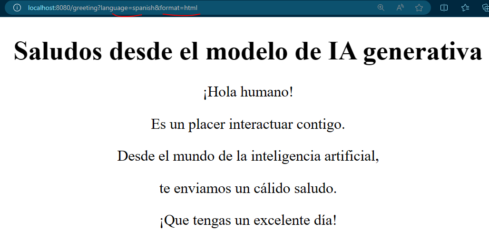
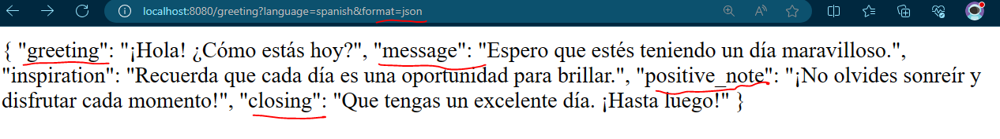
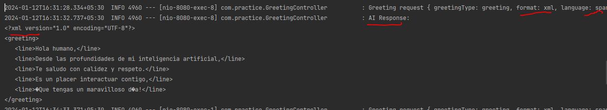

# springai-openai-prompt-hello-world

A spring-ai powered spring-boot microservice accessing OpenAI's api. This example will demonstrate how to use prompt
and prompt templates using SpringAI api.

## Technologies used
1. spring-boot: '3.2.1'
2. spring-ai: 0.8.0-SNAPSHOT
3. gradle: 8.5
4. java: 21
5. openai: API_KEY obtained from https://platform.openai.com/api-keys

### If you're beginner or this is your first SpringAI - OpenAI application, the [springai-openai-hello-world](https://github.com/krushnatkhawale/springai-openai-hello-world?tab=readme-ov-file#springai-openai-hello-world) is a good place to start as it has basic steps to get started with SpringAI and OpenAI.

## Steps for SpringAI and OpenAI integration

Following steps can be used to smoothly integrate AI(OpenAI) in a spring-boot application.


#### Step 1: Create a spring boot application

Create a spring-boot application using https://start.spring.io/ (spring initializer) with only <u>spring-boot-starter-web</u> dependency to begin with


#### Step 2: Add spring-ai's openai starter dependency

```groovy 
implementation 'org.springframework.ai:spring-ai-openai-spring-boot-starter:0.8.0-SNAPSHOT' 
```

As this library is still not released, the snapshots repository needs to be added to build.gradle to access snapshot versions.

```groovy
repositories {
	mavenCentral()
	maven { url 'https://repo.spring.io/snapshot' }
}
```

#### Step 3: Using org.springframework.ai.chat.ChatClient to interact with OpenAi api

The interface org.springframework.ai.chat.ChatClient is the base for all currently supported spring-ai implementations such as OpenAI,
Azure OpenAI, Hugging Face and Ollama. Planned implementations are Amazon Bedrock,Google Vertex: 'Bard'.

Currently, [OpenAiChatClient](https://github.com/spring-projects/spring-ai/blob/23e5c9ff7866075a48c13685dcc388e7851eb9db/models/spring-ai-openai/src/main/java/org/springframework/ai/openai/client/OpenAiChatClient.java#L62) which is OpenAI implementation of ChatClient enables communication with <b>gpt-3.5-turbo</b>.

In this example, ChatClient is used in the simplest Rest Controller as below

```java
@RestController
public class GreetingController {

    private static final Logger LOGGER = LoggerFactory.getLogger(GreetingController.class);

    private final ChatClient chatClient;

    public GreetingController(ChatClient chatClient) {
        this.chatClient = chatClient;
    }

    @GetMapping("/greeting")
    public String greet(@RequestParam(name = "greetingType", defaultValue = "greeting") String greetingType,
                        @RequestParam(name = "format", defaultValue = "text") String format,
                        @RequestParam(name = "language", defaultValue = "English") String language){

        LOGGER.info("Greeting request { greetingType: {}, format: {}, language: {} }", greetingType, format, language);

        final String greetingTemplate = """
                As a modern generative AI model,
                Generate a 5 liner {greetingType} in your style for a human in {language} in {format} form.
                Thanks in advance.
                """;

        final PromptTemplate promptTemplate = new PromptTemplate(greetingTemplate);

        final Prompt prompt = promptTemplate.create(Map.of("greetingType", greetingType, "format", format, "language", language));

        final String aiClientResponse = chatClient.generate(prompt)
                .getGeneration()
                .getContent();

        LOGGER.info("AI Response: \n{}", aiClientResponse);

        return aiClientResponse;
    }
}
```

#### Step 4: Configure API key to enable OpenAI api access

The last step to enable this spring-boot app and OpenAI api communication is to add API to configuration file
`application.properties` as shown below.

```properties
spring.ai.openai.api-key=${YOUR_OPENAI_API_KEY}
```
Remember not to add your key in config file, instead store it in your environments variable using below command, and
it will be automatically accessed by spring-boot.

```shell
export YOUR_OPENAI_API_KEY=<INSERT YOUR KEY HERE>
```

With these steps, your application is ready to talk to OpenAI using spring-ai library.
Run the application and hit url <u>http://localhost:8080/greeting </u> using a browser or curl command.

The response to above request would be a response from OpenAI api with default parameters such as, greetingType: greeting, format: text, language: English.



There are three query parameters supported greetingType, format, language. Here are some of the examples with these query parameters provided,















Blog covering this topic: https://medium.com/@krushnatkhawale/unleashing-the-power-of-generative-ai-integrating-openais-api-with-springai-7bbc9ebbe138

Time spent on this repo : [](https://wakatime.com/badge/user/c0c95904-b67a-4a62-bb09-8d5a5255068b/project/018cfca9-9796-421f-b745-7b3810b52012)

### Inspiration and References:

- [Spring AI :: Spring AI Reference](https://docs.spring.io/spring-ai/reference/index.html)
- [Enabling LLMs in Cloud Native Java, a presentation with Arun Gupta — YouTube](https://www.youtube.com/watch?v=N5HqaIBT1v0)


